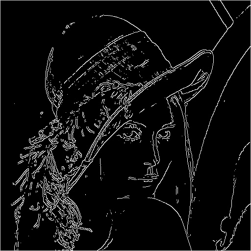

# Canny Filter
Canny Filter finds edges in an image.
## Input Image

## Output Image

# Process
## Gaussian Filter

## Sobel Filter
### x-axis
.jpg)
### y-axis
.jpg)
## Non Maximum Suppression

## Hysteresis Threshold

